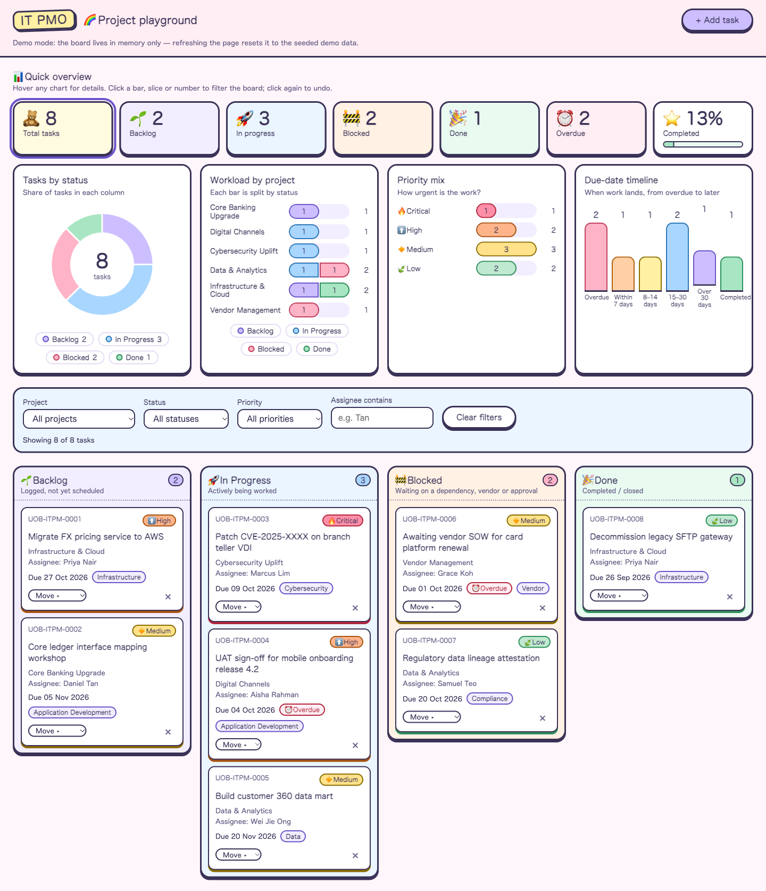

# IT PMO Project Board

A single-file, kid-friendly Kanban board demo for an IT PMO team at a fictitious bank, with an interactive overview dashboard. Built with vanilla HTML, CSS and JavaScript, with no dependencies.

**Live demo:** https://LowKhengLiang.github.io/clade_workshop/



## Features

- Cute pastel "sticker" design with emoji icons; colour is always paired with text or an icon.
- Quick-overview dashboard: KPI tiles (total, per status, overdue, completion %) and four charts: status donut, workload by project (stacked by status), priority mix and due-date timeline.
- Tableau-style interactivity: hover any mark for a tooltip, click a slice, bar, legend item or KPI tile to cross-filter the board and every other chart (selected marks highlight, the rest dim), click again to undo. Active filters show as removable chips. Fully keyboard accessible.
- Four columns: Backlog, In Progress, Blocked, Done.
- Drag and drop cards between columns, or use the keyboard-accessible **Move ▸** menu on each card.
- Filter by project, status, priority and assignee. The KPI tiles always count all tasks, regardless of filters.
- Overdue tasks (due date before today and not Done) are highlighted. Seed due dates are relative to today, so overdue examples always exist.
- Add Task form with validation. Each new task gets an ID like `UOB-ITPM-####` and triggers an email notification through [FormSubmit](https://formsubmit.co). If the email fails, the task is still added and a warning toast is shown.
- Delete with an inline "Delete? Yes/No" confirmation.

## Run locally

```sh
open index.html
```

## Notes

- Everything lives in `index.html` (markup, styles, script). There is no build step, bundler or package manager.
- Nothing is persisted (no localStorage, cookies or IndexedDB). Refreshing the page resets the board to its seed data.
- The only network call is the FormSubmit AJAX request. Set `FORMSUBMIT_ENDPOINT` at the top of the script to your own endpoint. Prefer FormSubmit's random-string alias over a raw email address, since the page source is public.

## Security

- A Content-Security-Policy meta tag limits the page to inline script/style and a single network target (`formsubmit.co`).
- All user text is escaped before it touches `innerHTML`; tooltips and toasts use `textContent`; chart filter values are whitelisted; drops only act on a card dragged within the board.
- Form input is validated and length-limited, and control characters are stripped before the notification is sent. Requests send no referrer or credentials.

## Deployment

Pushes to `main` run `.github/workflows/pages.yml`: the `validate` job syntax-checks the script and enforces the project constraints, then the `deploy` job publishes `index.html` to GitHub Pages.
